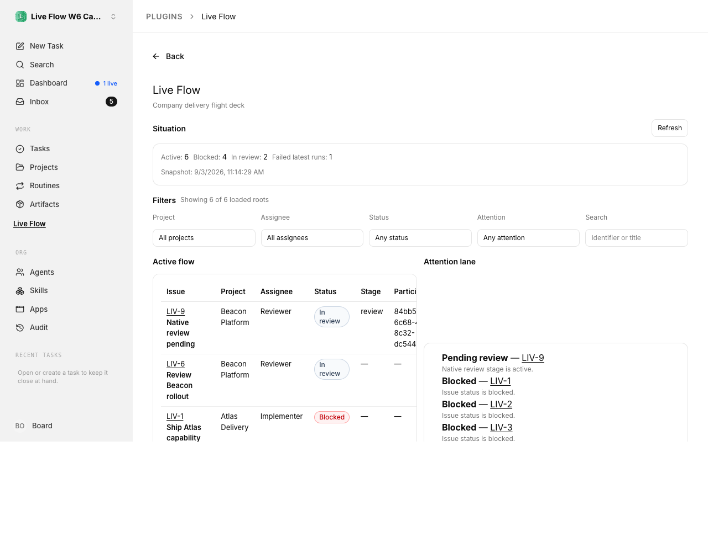
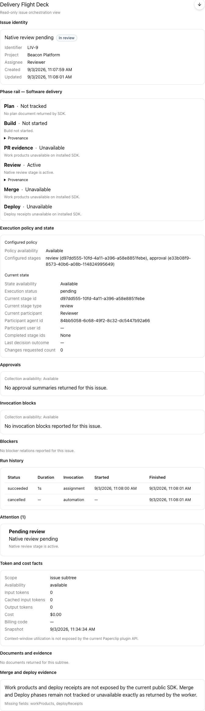
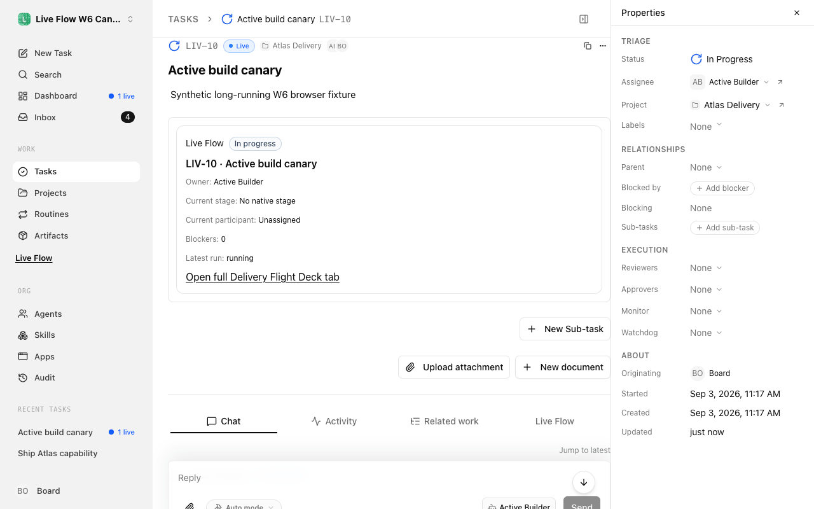
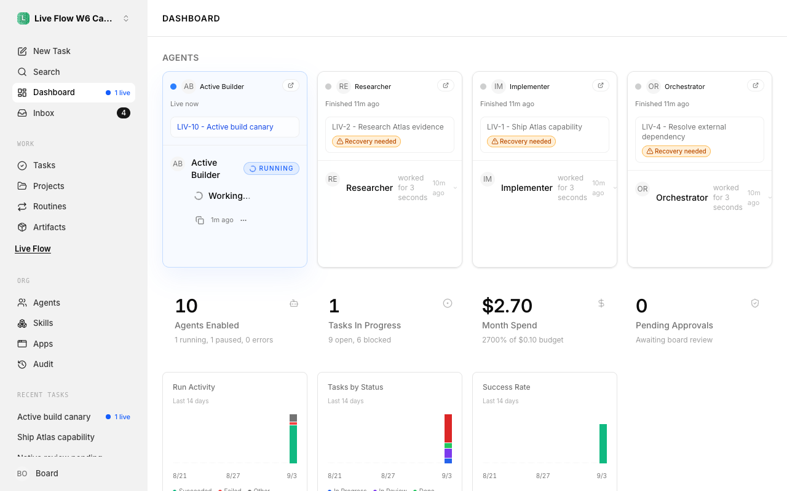

# Live Flow

Read-only workflow visibility for Paperclip — a community reference implementation for
[`paperclipai/paperclip#2741`](https://github.com/paperclipai/paperclip/issues/2741).

| Field           | Value                                                  |
| --------------- | ------------------------------------------------------ |
| **npm package** | `@gloops/paperclip-live-flow`                          |
| **Manifest ID** | `gloops.live-flow`                                     |
| **Version**     | `0.1.0` (unreleased — see [CHANGELOG](./CHANGELOG.md)) |
| **License**     | MIT                                                    |

Live Flow answers two operator questions **without leaving the Paperclip UI**:

1. **Company view:** What work is active, where is it in the native lifecycle, who owns it,
   what is blocked, and what needs attention?
2. **Issue view:** What happened end to end, which native execution stage is current, which
   runs and dependencies support that claim, and which token/cost facts are actually
   available from the public plugin SDK?

It is an **additive, read-only plugin** — not a workflow engine, lifecycle writer, Paperclip
fork, or production bootstrap install.

## Product surfaces

| Surface                    | Slot                                   | Purpose                                                                             |
| -------------------------- | -------------------------------------- | ----------------------------------------------------------------------------------- |
| **Live Flow** company page | `page` + `sidebar`                     | Situation strip, active flow table, attention lane, client-side filters             |
| **Delivery Flight Deck**   | `detailTab` + `taskDetailView` (issue) | Phase rail, blocker list/table, runs, approvals, token/cost panels, host deep links |
| **Dashboard widget**       | `dashboardWidget`                      | Active/blocked/review counts, top attention items, link to company page             |
| **Project entry**          | `projectSidebarItem`                   | Deep-link to company page with initial project filter via host navigation           |

Full contract: [`docs/delivery-contract.md`](./docs/delivery-contract.md). Architecture and
upstream pin: [`docs/architecture.md`](./docs/architecture.md).

## Screenshots and demo evidence

**W6 verification complete (2026-09-03).** Twelve PNG screenshots are tracked in git under
[`docs/evidence/screenshots/`](./docs/evidence/screenshots/) with digests in
[`docs/evidence/screenshots/MANIFEST.json`](./docs/evidence/screenshots/MANIFEST.json).
Master receipt: [`docs/evidence/MANIFEST.json`](./docs/evidence/MANIFEST.json) (4 linked JSON receipts). Full inventory:
[`docs/screenshot-inventory.md`](./docs/screenshot-inventory.md). Verification runbook:
[`docs/verification-runbook.md`](./docs/verification-runbook.md). Browser accessibility:
[`docs/evidence/browser-accessibility-check.json`](./docs/evidence/browser-accessibility-check.json).

| Surface                                             | Screenshot                                                                                       |
| --------------------------------------------------- | ------------------------------------------------------------------------------------------------ |
| Company page (light, desktop)                       |  |
| Pending review (LIV-9, detail tab)                  |               |
| Compact task detail (LIV-1, default streamlined UI) |   |
| Dashboard widget                                    |       |

Large browser canary artifacts (11M HAR, 36M Playwright trace, 3.7M video) are
**release-attachment-only** — SHA256 digests in the master manifest; not committed to git.

Directional design references (not release evidence) live in the source implementation plan
under `assets/paperclip-live-flow/` in the strategy repository.

## Factual evidence semantics

Live Flow displays only facts the **public Paperclip plugin SDK** exposes. Derived labels
(phase rail, attention reasons) carry provenance pointers to authoritative SDK fields.

| Situation                       | UI behavior                                                                                        |
| ------------------------------- | -------------------------------------------------------------------------------------------------- |
| Authoritative SDK field present | Display unchanged or with explicit derivation note                                                 |
| Field missing on installed SDK  | `not_available` / `Unavailable` — never inferred                                                   |
| Orchestration summary failed    | Row-level degradation; `orchestrationAvailability: unavailable`                                    |
| Merge / deploy phases           | `not_tracked` / `unavailable` unless SDK work-product or deploy receipt exists — never synthesized |
| Context-window utilization      | Fixed copy: not exposed by current plugin API                                                      |
| Issue `done`                    | Never presented as merged or deployed                                                              |
| Company active count            | Loaded active roots only — **not** a bounded “recent done” sample                                  |
| Token/cost totals               | Scoped labels (`issue`, `subtree`, `loaded active roots`) — not all-time company spend             |

Full field-by-field mapping: [`docs/evidence.md`](./docs/evidence.md).

## Read-only boundary and security

- **Manifest:** read capabilities and UI registration only — no `*.write`, `agents.invoke`,
  `jobs.schedule`, `http.outbound`, or plugin actions in `0.1.0`.
- **Worker:** stock `PluginContext` SDK reads only; host-injected `params.companyId` scopes
  every fetch; cross-company entities fail closed.
- **UI:** trusted **same-origin** code — **not** sandboxed by manifest capabilities. Data
  reads use `usePluginData` only; navigation uses `useHostNavigation().linkProps(...)` with
  documented host path conventions. No direct `fetch`/XHR/WebSocket/form posts to ordinary
  Paperclip API routes.
- **Install trust:** local-path and npm installs run **instance-level trusted code** on the
  Paperclip host you target. Install only plugins you authored or explicitly trust.

Details: [`docs/privacy.md`](./docs/privacy.md), [`SECURITY.md`](./SECURITY.md).

## Compatibility

Targets unmodified upstream Paperclip
[`da0947d3582ac7779d6bf11851c9938eca6c5c8c`](https://github.com/paperclipai/paperclip/commit/da0947d3582ac7779d6bf11851c9938eca6c5c8c)
with `@paperclipai/plugin-sdk` **1.0.0** and `@paperclipai/shared` **0.3.1**.

Build/test toolchain: Node **≥24.11.0**, pnpm **9.15.4** (see `package.json` `engines`).

**Tested vs targeted:** all local deterministic gates and isolated stock Paperclip browser
canary **passed at W6** (pin `da0947d`, SDK **1.0.0**, canary `http://127.0.0.1:3120`, plugin
status `ready`). After host upgrade, confirm target with `paperclipai plugin target` and re-run
gates — **no** automatic SDK version detection in the plugin.

Full matrix: [`docs/compatibility.md`](./docs/compatibility.md).

## Install, upgrade, and uninstall

Use **exact upstream CLI semantics** from the pinned authoring guides — never install into
long-lived production Paperclip as part of this bootstrap.

1. Confirm target: `paperclipai plugin target` (or `--api-base` / `PAPERCLIP_API_URL`).
2. Build: `pnpm build` (keep `pnpm dev` running for local-path reload).
3. Install local path (isolated canary only):

   ```bash
   paperclipai plugin install /absolute/path/to/paperclip-live-flow
   ```

4. Or install npm package (after W7 publish):

   ```bash
   paperclipai plugin install @gloops/paperclip-live-flow@0.1.0
   ```

5. Verify: `paperclipai plugin list` and `paperclipai plugin inspect gloops.live-flow`.
6. Upgrade: `paperclipai plugin upgrade gloops.live-flow` (optional version pin per upstream).
7. Pause: `paperclipai plugin disable gloops.live-flow` / `enable gloops.live-flow`.
8. Remove: `paperclipai plugin uninstall gloops.live-flow` — add **`--force`** to purge plugin
   state and settings immediately (upstream grace-period warning applies without `--force`).

Complete operator reference with upstream citations:
[`docs/operator-commands.md`](./docs/operator-commands.md).

## Local development and verification

Requires Node **≥24.11.0** and pnpm **9.15.4**.

```bash
pnpm install
pnpm dev            # watch build → dist/manifest.js, dist/worker.js, dist/ui/
pnpm dev:ui         # optional HMR UI server on http://127.0.0.1:4177
pnpm format:check
pnpm lint
pnpm typecheck
pnpm test
pnpm test:coverage
pnpm build
pnpm check:ui-boundary
pnpm pack:check
```

SDK tarballs for reproducible builds live under `.paperclip-sdk/` (excluded from published
npm `files`). Browser verification requires an **isolated** stock Paperclip checkout on a
dedicated port — see [`docs/verification-runbook.md`](./docs/verification-runbook.md).

## Privacy

No plugin telemetry, external analytics, or direct UI HTTP/database access. Data appears only
inside authenticated Paperclip company scope. Worker uses a short-lived in-memory cache
(company+handler+args, TTL ≤15s); UI may retain the last bridge snapshot on error — **no**
persistent plugin storage in `0.1.0`. See [`docs/privacy.md`](./docs/privacy.md).

## Known limitations (v0.1.0)

- No org-chart overlay (no SDK slot).
- No lifecycle writes, scheduled jobs, or background reconcilers.
- No merge/deploy/context-window/token-efficiency claims without authoritative SDK facts.
- No “recent done” company window — active list statuses only.
- No all-time company spend aggregate.
- Branch/workspace facts not exposed by SDK are omitted.
- Registry install proof and npm publish: **pending W7**.
- **Stock host UI settings:** default `enableClassicTaskInterface=false` hides the issue
  `detailTab`; default `enableStreamlinedUi=true` hides classic `SidebarProjects` /
  `projectSidebarItem`. W6 screenshots that show those slots used the noted stock overrides;
  see [`docs/compatibility.md`](./docs/compatibility.md).
- **Streamlined task detail:** compact `taskDetailView` works in default UI; the “Open full
  Delivery Flight Deck tab” link navigates to the issue URL but stock IssueDetail does not
  activate a plugin detail tab from the query while streamlined mode hides the tab.

## Upstream issue #2741

Community reference mapping — **partial** overlap with #2741, not full fulfillment (see
[`docs/issue-2741.md`](./docs/issue-2741.md)). Upstream-facing notes should use `Refs #2741`.

## Support and community

| Resource                          | URL                                                                                                                            |
| --------------------------------- | ------------------------------------------------------------------------------------------------------------------------------ |
| Repository                        | https://github.com/gloopsAI/paperclip-live-flow                                                                                |
| Issues                            | https://github.com/gloopsAI/paperclip-live-flow/issues                                                                         |
| Security                          | [`SECURITY.md`](./SECURITY.md)                                                                                                 |
| Contributing                      | [`CONTRIBUTING.md`](./CONTRIBUTING.md)                                                                                         |
| Upstream Paperclip                | https://github.com/paperclipai/paperclip                                                                                       |
| Upstream #2741                    | https://github.com/paperclipai/paperclip/issues/2741                                                                           |
| Plugin authoring (pinned)         | https://github.com/paperclipai/paperclip/blob/da0947d3582ac7779d6bf11851c9938eca6c5c8c/doc/plugins/PLUGIN_AUTHORING_GUIDE.md   |
| Local plugin development (pinned) | https://github.com/paperclipai/paperclip/blob/da0947d3582ac7779d6bf11851c9938eca6c5c8c/doc/plugins/LOCAL_PLUGIN_DEVELOPMENT.md |

## Model roles (bootstrap disclosure)

| Role                    | Declared model           | Notes                                                                          |
| ----------------------- | ------------------------ | ------------------------------------------------------------------------------ |
| Execution parent        | `gpt-5.6-sol-high`       | Contract, integration, release                                                 |
| Documentation/UI worker | `composer-2.5`           | Per checked-in agent routing                                                   |
| Grok medium             | `cursor-grok-4.6-medium` | Attempts failed with `resource_exhausted` — **no Grok implementation claimed** |
| Runtime worker identity | —                        | Cursor did not expose backend model ID; route known, identity **unverified**   |

See [`docs/architecture.md`](./docs/architecture.md) and [`docs/delivery-contract.md`](./docs/delivery-contract.md).
